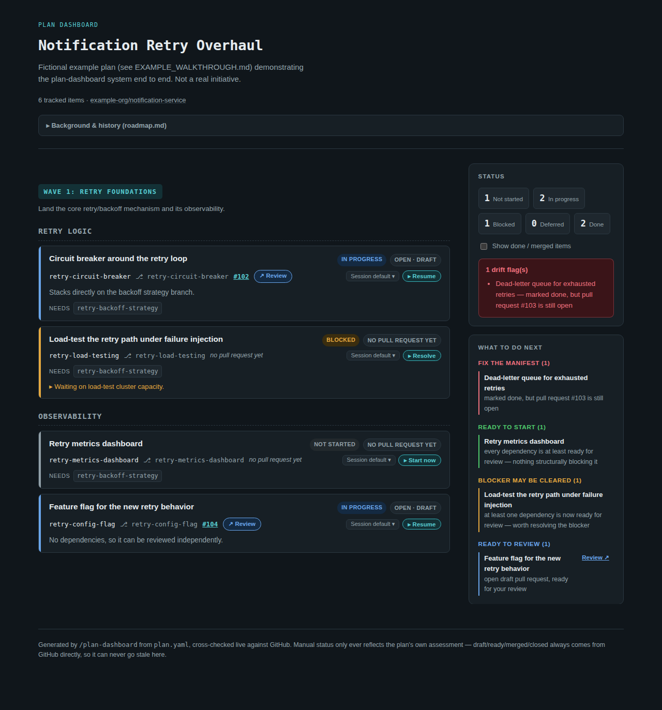
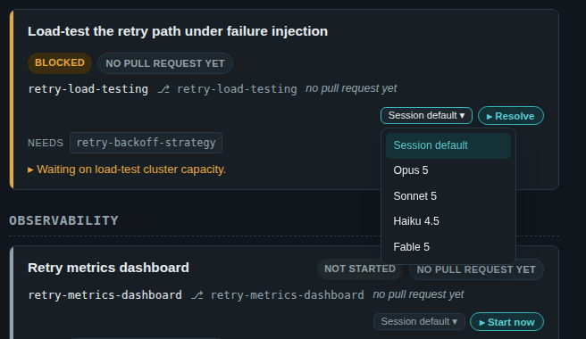

# A worked example: idea to dashboard

A short, concrete walkthrough of the plan-dashboard system end to end, using
a small **fictional** example plan — no real branches, PRs, or GitHub calls
involved.

The only thing this assumes is a fork of this repository with the `.claude/`
tooling on its default branch. If you haven't set anything up yet, run
`/setup-personal-notes` once — it checks what's already in place, asks about
anything it can't decide for you, and finishes in seconds if you're already
set up. (You don't have to run it first: any skill below offers it if you
need it.) [`.claude/hooks/README.md`](../../hooks/README.md) documents what it
configures, for when you want the details.

The example data referenced below is committed alongside this file, under
[`example/`](./example/) — real `plan.yaml`, `roadmap.md`, and `pr_data.json`
files, not just prose. You can render them yourself with no GitHub access at
all:

```bash
cd .claude/skills/plan-dashboard
pip install -r requirements.txt
python3 build_dashboard.py --plan example/plan.yaml --roadmap example/roadmap.md \
  --pr-data example/pr_data.json --output /tmp/example-dashboard.html
```

## 1. Start with the idea, in plan mode

You describe what you want, in your own words. No special syntax:

> **You:** Notification delivery fails hard on the first transient error. I
> want to add a retry mechanism with backoff, a circuit breaker so a
> persistently failing downstream service doesn't get hammered, and the
> metrics/alerting to run it safely. Can you plan this out?

Claude enters plan mode, asks any clarifying questions, and proposes a
concrete plan — phases, files, how each part gets verified. You review it and
approve.

## 2. Turn the approved plan into a tracked, multi-PR plan

A single Claude Code plan-mode plan is ephemeral — it lives in this one
conversation. Once it's clear the work spans more than one PR or session (as
this one does: backoff, circuit breaker, dead-letter queue, and a metrics
dashboard are each their own branch), turn it into a **persistent plan**:

> **You:** `/plan-create notification-retry-overhaul`

The [`plan-create`](../plan-create/SKILL.md) skill asks where the plan's
content comes from — here, "from this conversation" (the plan you just
approved). It then asks a few structural questions it won't guess at (does
this need multiple tracks? waves?), drafts a schema-conformant
`plan.yaml`/`roadmap.md`, validates it, and — after asking whether you want
one — optionally creates a **tracking issue** as a shared mailbox for later
structural changes (skipped in this example, since it's small enough for one
session to own end to end). Finally it pushes both files to the
`claude/personal-notes` branch and publishes the first dashboard.

## 3. The resulting plan.yaml and roadmap.md

Here's what came out the other end (the real files are at
[`example/plan.yaml`](./example/plan.yaml) and
[`example/roadmap.md`](./example/roadmap.md)):

```yaml
schema_version: 1
id: notification-retry-overhaul
title: Notification Retry Overhaul
default_repository: example-org/notification-service

waves:
  - id: wave-1
    name: "Wave 1: Retry foundations"

tracks:
  - id: retry-logic
    name: Retry logic
    wave: wave-1
  - id: observability
    name: Observability
    wave: wave-1

items:
  - id: retry-backoff-strategy
    title: Exponential backoff strategy for retries
    branch: retry-backoff-strategy
    track: retry-logic
    status: done
    pull_request_number: 101

  - id: retry-circuit-breaker
    title: Circuit breaker around the retry loop
    branch: retry-circuit-breaker
    track: retry-logic
    status: in_progress
    pull_request_number: 102
    depends_on: [retry-backoff-strategy]

  # ...three more items - see example/plan.yaml for the full list
```

`plan.yaml` is the **thin, structured** half: waves/tracks/items, statuses,
dependencies, PR numbers. Everything's own "why" — design decisions,
history, standing conventions — belongs in `roadmap.md` instead:

```markdown
# Notification Retry Overhaul — Roadmap

## Why
Notification delivery currently fails hard on the first transient error...

## Decisions locked in
- Retries use exponential backoff with jitter, not a fixed delay.
- Every item in the `retry-logic` track stacks its branch directly on
  `retry-backoff-strategy`'s branch once that pull request is open and
  ready for review — no need to wait for it to merge first.
```

Neither file ever stores live GitHub state (open/draft/merged/CI) — that's
always fetched fresh, every run, in the next step.

## 4. Publish (or refresh) the dashboard

> **You:** `/plan-dashboard notification-retry-overhaul`

The [`plan-dashboard`](./SKILL.md) skill cross-checks every item's PR against
live GitHub state, auto-corrects the one kind of drift that's unambiguous (a
merged PR whose item is still marked anything but `done`), and publishes an
Artifact:



A few things worth noticing in this one small example:

- **Status counts and a drift flag**, top right — `retry-fallback-queue` is
  marked `done` in the manifest, but its pull request (`#103`) is still
  open. That's the one thing a manifest can get wrong that GitHub itself
  can settle: the sidebar's "Fix the manifest" entry names exactly which
  item and why.
- **"Ready to start"** — `retry-metrics-dashboard` hasn't started yet, but
  its one dependency (`retry-backoff-strategy`) is done, so it's safe to
  build on.
- **"Blocker may be cleared"** — `retry-load-testing` is blocked (on load-test
  cluster capacity, per its own `blockers` note), but its dependency is now
  ready too, so it's worth a look.
- **"Ready to review"** — `retry-config-flag` has an open, still-draft pull
  request with nothing blocking it from being reviewed right now.
- **Done items are hidden by default** — the sidebar's "Show done / merged
  items" checkbox reveals `retry-backoff-strategy` and `retry-fallback-queue`
  when you want them back.

## 5. Kick off, resolve, or review a specific item

Every not-done item's card has an action button, worded to match its status,
plus a model dropdown next to it:



Clicking a button **copies the command** to your clipboard (a published page
can't start a session itself) — paste it into a fresh session to run it. If
you pick a model from the dropdown first, a `/model MODEL_ID` line is
prepended so the pasted session starts on that model.

- **Kick off a not-started item** — `retry-metrics-dashboard`'s "Start now"
  button copies `/plan-item-kickoff notification-retry-overhaul
  retry-metrics-dashboard`. The [`plan-item-kickoff`](../plan-item-kickoff/SKILL.md)
  skill gathers the item's context (manifest entry, roadmap history, its
  dependency's live state, patterns from already-landed sibling items) and
  proposes a concrete implementation plan via plan mode — it never writes
  code itself.
- **Resolve a stalled item** — `retry-load-testing`'s "Resolve" button copies
  `/plan-item-resolve notification-retry-overhaul retry-load-testing`. The
  [`plan-item-resolve`](../plan-item-resolve/SKILL.md) skill is
  `plan-item-kickoff`'s counterpart for an item that already has real state:
  it gathers PR mergeable status, CI, review comments, and recorded
  blockers, then proposes a plan to resolve whatever's actually stalling it
  — same plan-mode-only contract, no code changes.
- **Review a stalled draft PR** — `retry-circuit-breaker` and
  `retry-config-flag` both have open, still-draft pull requests, so each
  gets a "Review" button instead. Unlike the other two, this one isn't a
  skill invocation — it's a plain link straight to the PR on GitHub.

## Where to go from here

- [`.claude/hooks/README.md`](../../hooks/README.md) — the setup guide: what
  `/setup-personal-notes` configures, and how to change any of it.
- [`plan-schema.md`](./plan-schema.md) — the full `plan.yaml` schema
  reference.
- [`plan-dashboard/SKILL.md`](./SKILL.md),
  [`plan-create/SKILL.md`](../plan-create/SKILL.md),
  [`plan-item-kickoff/SKILL.md`](../plan-item-kickoff/SKILL.md),
  [`plan-item-resolve/SKILL.md`](../plan-item-resolve/SKILL.md) — the exact
  mechanics behind each step above.
